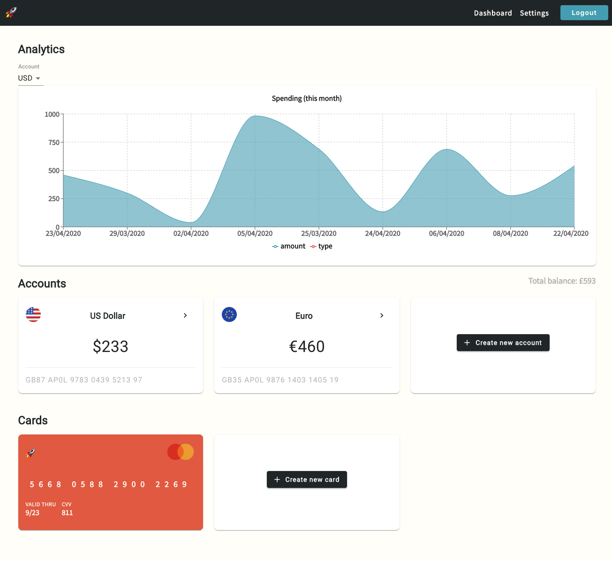

# expressbank 💸

A fullstack GraphQL banking application built using React, Node & TypeScript.

## What's included? 

* Login/register
* Dashboard
* Accounts
* Transactions
* Credit cards
* Settings 
* Spending for this month chart
* Dummy data generator using faker
  

Flag icons made by <a href="https://www.flaticon.com/authors/freepik" title="Freepik">Freepik</a> from <a href="https://www.flaticon.com/" title="Flaticon"> www.flaticon.com</a>
